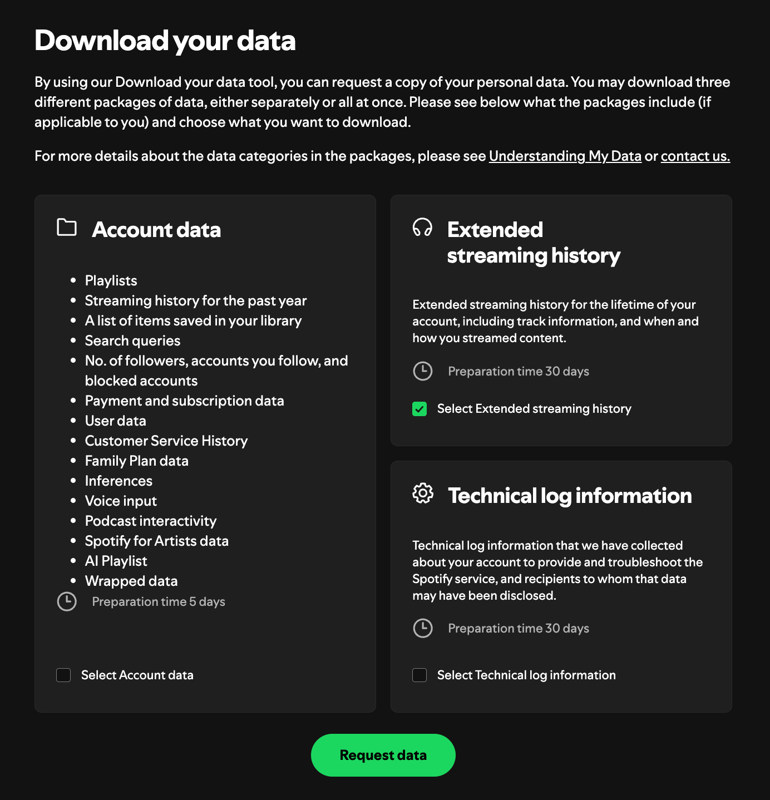

# Spotify Stats

visualize your spotify downloaded listening history

## how to get your listening data

1. go to [spotify privacy page](https://www.spotify.com/us/account/privacy/)
2. scroll down to download your data
   
3. press request data and wait for it on email

## installation

1. download dependencies

```sh
pip install -r requirements.txt
```

2. run main.py

```sh
python3 main.py
```
